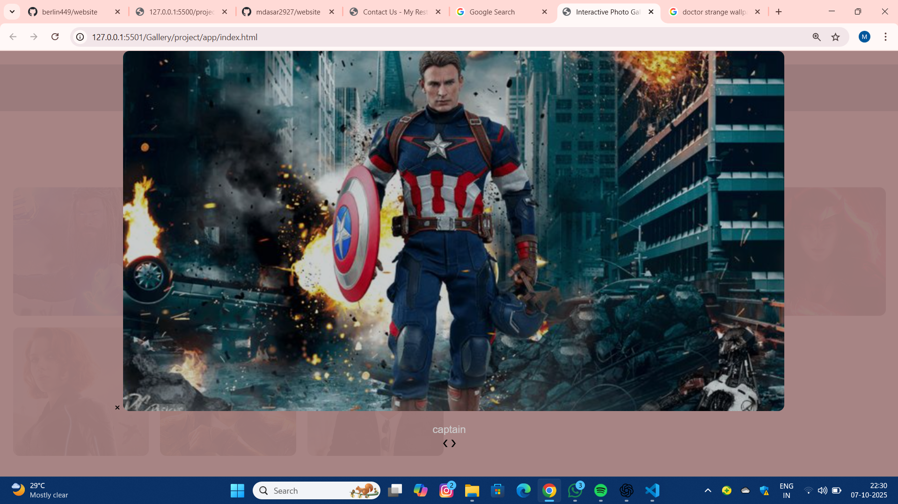

# Ex.08 Design of Interactive Image Gallery
# Date:07-10-2025
# AIM:
To design a web application for an inteactive image gallery with minimum five images.

# DESIGN STEPS:
## Step 1:
Clone the github repository and create Django admin interface.

## Step 2:
Change settings.py file to allow request from all hosts.

## Step 3:
Use CSS for positioning and styling.

## Step 4:
Write JavaScript program for implementing interactivity.

## Step 5:
Validate the HTML and CSS code.

## Step 6:
Publish the website in the given URL.

# PROGRAM :
```
index.html:


<!DOCTYPE html>
<html lang="en">
<head>
  <meta charset="UTF-8" />
  <meta name="viewport" content="width=device-width, initial-scale=1.0" />
  <title>Interactive Photo Gallery</title>
  <style>
    body {
      font-family: Arial, sans-serif;
      margin: 0;
      background: #f8f9fa;
      text-align: center;
    }

    .title {
      background: #0f4c5c;
      color: white;
      padding: 15px;
    }

    #searchBar {
      margin: 20px;
      padding: 10px;
      width: 60%;
      border-radius: 8px;
      border: 1px solid #ccc;
    }

    .gallery {
      display:grid;
      grid-template-columns: repeat(auto-fill, minmax(200px, 1fr));
      gap: 18px;
      padding: 20px;
    }

    .gallery img {
      width: 100%;
      height: 200px;
      object-fit: cover;
      border-radius: 10px;
      cursor: pointer;
      transition: transform 0.3s ease;
    }

    .gallery img:hover {
      transform: scale(2.05);
    }

/* Lightbox */
.lightbox {
  display: none;
  position: fixed;
  z-index: 1000;
  left: 0; 
  top: 0;
  width: 100%; 
  height: 100%;
  background-color: rgba(162, 125, 125, 0.95);
  justify-content: center;
  align-items: center;
}

.lightbox-content {
  max-width: 100%;
  max-height: 100%;
  border-radius: 10px;
}


    .close { top: 10px; right: 50px; }
    .prev { top: 50%; left: 30px; transform: translateY(-50%); }
    .next { top: 50%; right: 30px; transform: translateY(-50%); }
    .caption { color: #ccc; margin-top: 15px; }
  </style>
</head>
<body>
  <h1 class="title">📸 Interactive Photo Gallery</h1>

  <!-- Search Bar -->
  <input type="text" id="searchBar" placeholder="Search photos..." />

  <!-- Gallery -->
  <div class="gallery" id="gallery">
    
    
    
    
    
    
    
    
       
  </div>

  <!-- Lightbox -->
  <div id="lightbox" class="lightbox">
    <span class="close">&times;</span>
    
    <div class="caption" id="caption"></div>
    <span class="prev">&#10094;</span>
    <span class="next">&#10095;</span>
  </div>

  <script>
    const images = document.querySelectorAll(".gallery img");
    const lightbox = document.getElementById("lightbox");
    const lightboxImg = document.getElementById("lightboxImg");
    const caption = document.getElementById("caption");
    const closeBtn = document.querySelector(".close");
    const prevBtn = document.querySelector(".prev");
    const nextBtn = document.querySelector(".next");
    const searchBar = document.getElementById("searchBar");

    let currentIndex = 0;

    // Open lightbox
    images.forEach((img, index) => {
      img.addEventListener("click", () => {
        lightbox.style.display = "block";
        lightboxImg.src = img.src;
        caption.innerText = img.alt;
        currentIndex = index;
      });
    });

    // Close
    closeBtn.onclick = () => (lightbox.style.display = "none");

    // Next / Prev
    nextBtn.onclick = () => showImage(currentIndex + 1);
    prevBtn.onclick = () => showImage(currentIndex - 1);

    function showImage(index) {
      if (index >= images.length) index = 0;
      if (index < 0) index = images.length - 1;
      lightboxImg.src = images[index].src;
      caption.innerText = images[index].alt;
      currentIndex = index;
    }

    // Search filter
    searchBar.addEventListener("keyup", () => {
      let query = searchBar.value.toLowerCase();
      images.forEach(img => {
        img.style.display = img.alt.toLowerCase().includes(query) ? "block" : "none";
      });
    });
  </script>
</body>
</html>
```

# OUTPUT:



# RESULT:
The program for designing an interactive image gallery using HTML, CSS and JavaScript is executed successfully.
